# :octicons-graph-16: 狀態評估

???+ abstract "學習歷程：「狀態評估」"

    <figure markdown="span">
    
    <figcaption><small>「狀態評估」階段</small></figcaption>
    </figure>

    您目前在「[狀態評估]」，服務導入團隊將定期關懷，並協助提供在專案推進與問題協助。（完整流程：「[章節內容]」、「[操作手冊]」、「[政策制定]」、「[狀態評估]」、「[關懷與諮詢]」）

    [章節內容]: ../chapter/index.md
    [操作手冊]: ../user_guide/index.md
    [政策制定]: ../policy/index.md
    [狀態評估]: ../assessment/index.md
    [關懷與諮詢]: ../support/index.md

## 說明

透過相關的狀態評估表評估、評量目前組織內夥伴在資安抵禦知識與技能的成長程度。
