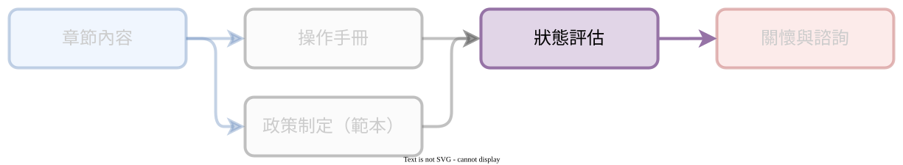

# :octicons-graph-16: 進度追蹤

???+ abstract "學習歷程：「進度追蹤」"

    <figure markdown="span">
    
    <figcaption><small>「進度追蹤」階段</small></figcaption>
    </figure>

    您目前在「[進度追蹤]」，服務導入團隊將定期關懷，並協助提供在專案推進與問題協助。（完整流程：「[課程主題]{target="_blank"}」、「[制定資安政策]{target="_blank"}」、「[進度追蹤]{target="_blank"}」、「[疑問諮詢]{target="_blank"}」）

    [課程主題]: ../chapter/index.md
    [制定資安政策]: ../policy/index.md
    [進度追蹤]: ../assessment/index.md
    [疑問諮詢]: ../support/index.md

## 說明

透過相關的進度追蹤表評估、評量目前組織內夥伴在資安抵禦知識與技能的成長程度。
