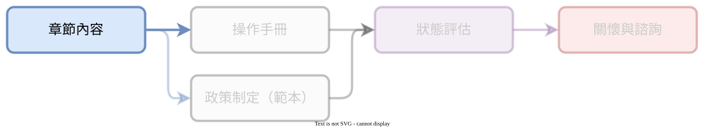
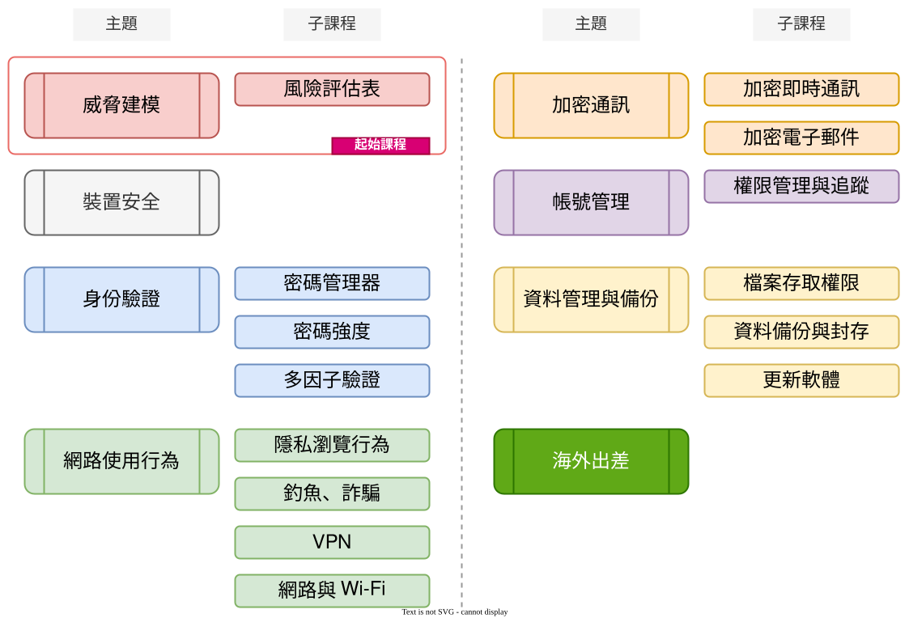

# :octicons-book-16: 課程主題

???+ abstract "學習歷程：「課程主題」"

    <figure markdown="span">
    
    <figcaption><small>「課程主題」階段</small></figcaption>
    </figure>

    您目前在「[課程主題]{target="_blank"}」，這裡收錄基本資訊安全相關的課程與教材。（完整流程：「[課程主題]{target="_blank"}」、「[操作指南]{target="_blank"}」、「[制定資安政策]{target="_blank"}」、「[進度追蹤]{target="_blank"}」、「[疑問諮詢]{target="_blank"}」）

    [課程主題]: ../chapter/index.md
    [操作指南]: ../user_guide/index.md
    [制定資安政策]: ../policy/index.md
    [進度追蹤]: ../assessment/index.md
    [疑問諮詢]: ../support/index.md

資訊安全課程項目提供了全面的知識和技能，幫助您保護組織的重要資料和資訊安全。本教材內容以「組織」為對象，內容皆以組織為中心，來發展出概念教學內容和演練實作項目。若您為個人或是小群體，也可以參考內容並進行調整。

「課程主題」此處主要是提供組織和執行者基礎概念，來了解資安防禦和個別使用行為的背後原理，進而更清楚在「操作手冊」之中落實行動的目的並增加執行的準確度。

## 主題簡介

1. [威脅建模](./threat_modeling_class.md){target="_blank"}（Threat modeling）：這門課程將教學員如何識別與評估資訊安全威脅，並制定有效的防禦策略。
2. [裝置安全](./devices.md){target="_blank"}：這門課程專注於如何保護硬體裝置，包括防止硬體被竊取以及避免硬體級別的攻擊。
3. [身分驗證](./profile/index.md){target="_blank"}：學員將學習如何使用密碼管理器、建立強密碼，以及實施雙重或多因子身分驗證，以提高身份識別的安全性。
4. [網路使用行為](./network/index.md){target="_blank"}：這門課程探討如何在網路上安全行事，包括隱私瀏覽技巧和防範釣魚攻擊的方法。學員將學會使用 VPN 和瞭解網路安全原則，以便安全地使用公共 Wi-Fi 和其他網路連線。
5. [加密通訊與電子郵件](./e2ee/index.md){target="_blank"}：這門課程將教導學員如何運用加密技術來保護通訊和電子郵件，防止未經授權的訪問。
6. [帳號管理](./account/index.md){target="_blank"}：這門課程強調如何有效管理帳號，包括帳號權限管理、活動追蹤和監控的方法。
7. [資料管理與備份](./files_management/index.md){target="_blank"}：學員將學習如何有效地管理和保護組織的資料，包括檔案存取權限控制、資料分層管理、備份策略和軟體更新的方法。
8. [海外出差](https://ssd.ocf.tw/chapter/abroad.html)：這門課程將提供學員在海外出差期間維持資料和身份安全的實用建議和實作方法。

## 主題與課程

<figure markdown="span">
  
  <figcaption><small>「課程主題」主題與課程</small></figcaption>
</figure>
