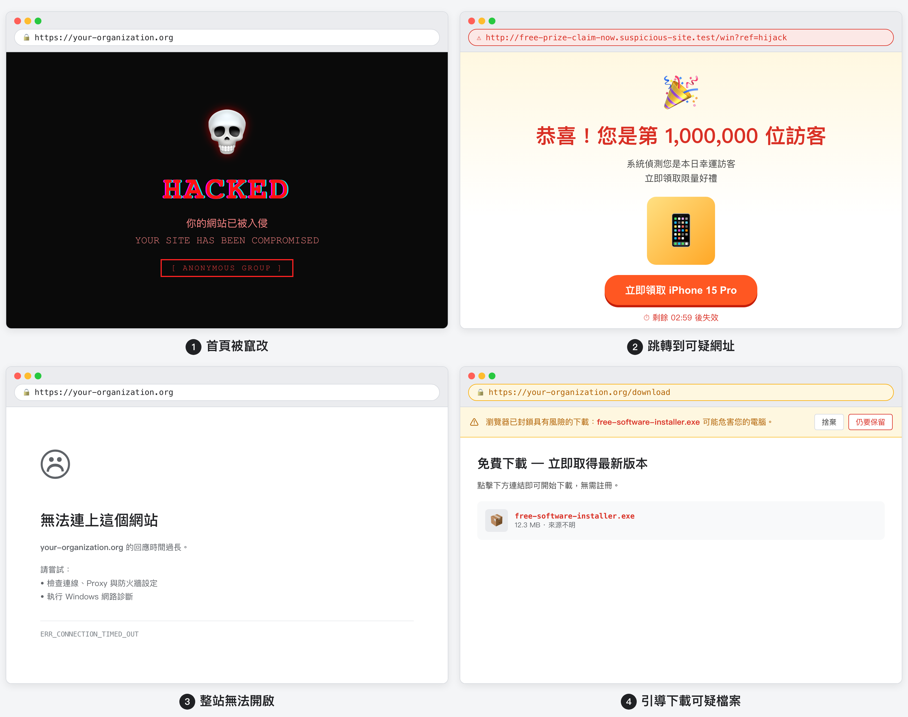

# 官網遭受攻擊

官網遭受攻擊，在這裡泛指團體對外網站出現異常：例如首頁內容被換成不相干的圖片或文字、點進去被帶到奇怪的網站、整站打不開，或訪客被引導去下載可疑檔案。對公民團體來說，官網就像新手村門口的告示牌與招牌，一旦被竄改，不只影響信任，也可能讓關心議題的人誤以為是團體釋出的訊息。

<figure markdown="span">
  { style="width: 100%; border-radius: 8px; margin-bottom: 1rem;" }
  <figcaption>常見的四種官網異常徵兆示意圖（自製設計稿，CC-BY 4.0）。</figcaption>
</figure>

## 處理方式

1. **先確認並留下紀錄**： 用電腦或手機瀏覽器開啟官網，觀察是「畫面內容被改」「完全無法連線」或「會跳到別的網址」。建議**截圖**或記下**時間**、網址列顯示的內容，方便之後向主機商或協助者說明。
2. **向官方管道求助**： 聯絡你們使用的**網站主機、架站平台或網域註冊商**的**官方客服**（從官網公布的聯絡方式進入），說明狀況並依指示處理。**不要**只依照陌生私訊、即時訊息裡自稱「幫你修網站」的陌生人操作或提供後台密碼。
3. **組織內通報**： 通知團體**事先約定的窗口**（資安、行政或網站維護人員）。**不要**在公開社群貼文裡寫出後台網址、帳號或臨時密碼。
4. **阻斷與復原**： 由負責人與可信任技術協助判斷，是否需先將網站改為**維護中**、暫時**關閉公開存取**，或從**乾淨備份還原**網站。事件處理後，請在官方後台**更換**主機、內容管理系統（若使用）、網域管理等相關**密碼**，並檢查管理員名單，**移除**不認識的帳號或撤銷不使用的 API、金鑰（各平台用語不同，請以實際畫面為準）。
5. **必要時尋求公權力協助**： 若涉及恐嚇勒贖、詐騙，或對團體造成重大影響，可諮詢或向 **165 反詐騙專線**、**當地警察局**說明狀況。

## 預防方式

1. **備份網站並確認可還原**： 依使用方式定期備份網站檔案與資料庫（若你的架站方式有資料庫），並實際確認備份檔可用。細部規劃可參考本站的「實體備份」教學，其中也將官網與相關線上服務納入關鍵資料。
2. **限制後台權限與加固帳號**： 管理員帳號**愈少愈好**；主機或內容管理系統若支援**雙重驗證**，建議為管理員開啟。密碼請**專用於該服務**、長度與強度足夠，並用**密碼管理器**保存。組織可透過「數位服務帳號盤點」列清官網、網域與伺服器帳號，並搭配「組織雙重驗證」「組織密碼管理」訂出規則。
3. **更新與安裝來源**： 若網站使用內容管理系統與外掛、佈景，請盡量**更新到官方釋出的安全版本**；避免安裝來路不明的外掛或破解版軟體。
4. **釣魚與帳號習慣**： 負責管理網站的人若誤點釣魚連結、在假頁面登入後台，等於把大門鑰匙交出去。可複習「釣魚、詐騙郵件」與「帳號密碼外洩」單元，把辨識可疑連結與通報流程變成習慣。
5. **透過 OCF 申請 Cloudflare 防護**： [開放文化基金會（OCF）](https://security.ocf.tw/network/cloudflare/){target="_blank"} 參與 Cloudflare Project Galileo 計畫，可協助符合資格的台灣公民團體免費取得 Cloudflare 的 DDoS 防護、CDN 與其他網站安全服務，並提供中文審核協助。若有申請需求，可直接聯繫 OCF。

## 參考知識

  

    <h3 class="sub-category-card__title">釣魚、詐騙郵件</h3>
    
預計閱讀時間：約 10 分

    
假冒主機商或平台寄來的信件，常誘導你點連結登入假後台。學會辨識寄件來源與可疑內容，保護管理員帳號。

    <a href="phishing.html" class="sub-category-card__cta">› 馬上複習</a>
  

  

    <h3 class="sub-category-card__title">數位服務帳號盤點</h3>
    
首次盤點約 0.5–1 天，其後每 3–6 個月更新約 1–2 小時

    
建立官網、網域與伺服器等帳號清單，釐清誰有後台權限，出事時才知道要通知誰、要改哪些密碼。

    <a href="../org/account/audit.html" class="sub-category-card__cta">› 馬上盤點</a>
  

  

    <h3 class="sub-category-card__title">實體備份</h3>
    
首次規劃約 0.5–1 天，之後定期檢查約 1–2 小時

    
協助組織把官網與關鍵線上服務納入備份範圍，遭竄改時才有乾淨版本可以還原。

    <a href="../org/backup/physical.html" class="sub-category-card__cta">› 馬上規劃</a>
  

