# :octicons-file-directory-open-fill-16: 教材資源

???+ abstract "學習歷程：「章節內容」、「操作說明」"

    <figure markdown="span">
    
    <figcaption><small>此階段專注在「章節內容」、「操作手冊」</small></figcaption>
    </figure>

    此頁面將針對「[章節內容]」、「[操作手冊]」的使用說明。（完整流程：「[章節內容]」、「[操作手冊]」、「[政策制定]」、「[狀態評估]」、「[關懷與諮詢]」）

    [章節內容]: ../chapter/index.md
    [操作手冊]: ../user_guide/index.md
    [政策制定]: ../policy/index.md
    [狀態評估]: ../assessment/index.md
    [關懷與諮詢]: ../support/index.md

## 章節內容說明

<figure markdown="span">
  
  <figcaption><small>「章節內容」的主題與子課程</small></figcaption>
</figure>

「章節內容」的制定涵蓋組織分險評估、個人設備裝置安全、身份驗證、網路使用行為、加密通訊、帳號管理、資料管理與備份、海外出差。以上主題部份將拆分更細的子課程來完整主題課程內涵。

其中「威脅建模」會是所有參與組織的起始課程，服務導入團隊將帶領各位一起謹慎省思組織內、外所面臨的風險與威脅，並產出一到數份不同面向的「風險評估表」。

## 操作手冊說明

<figure markdown="span">
  
  <figcaption><small>閱讀「章節內容」後透過「操作手冊」修正與加強</small></figcaption>
</figure>

各章節的「主題課程」後，再透過搭配相對應課程的「操作手冊」調整裝置、作業系統、網路設定服務來修正與增強資安抵禦能力。
