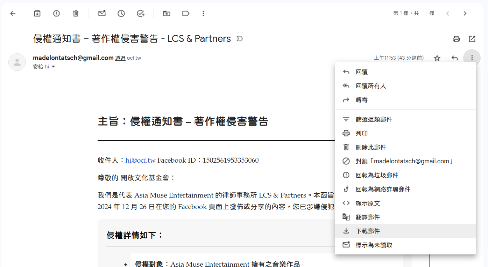
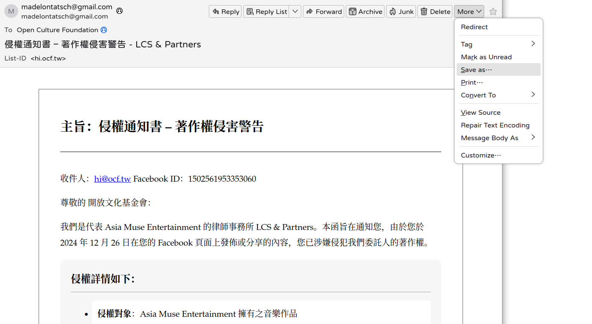
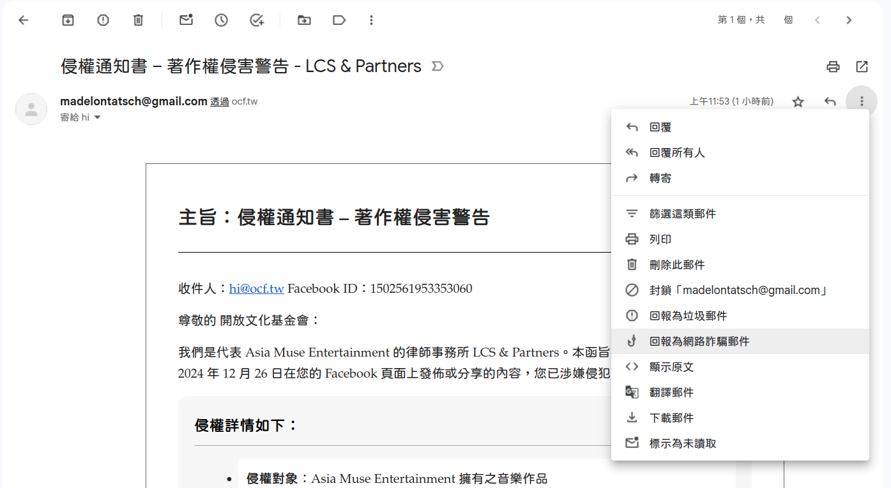

# 資安通報流程

此流程適用於一般日常，如發現疑似或是確認為資安事件，都可以遵循以下的事件處理方式。

## 通報管道

1. 透過 <ssd@ocf.tw> 專案群組信箱。
2. 透過已建立聯繫管道的群組 Signal 頻道。

## 通報事件類型

- :material-email-alert-outline: __[釣魚、詐騙郵件](#_4)__ 透過郵件冒名寄送內容、不明附加檔案。

### 釣魚、詐騙郵件

近期常見的釣魚、詐騙郵件內容會透過版權侵害宣告、海關報關通知、快遞貨運追蹤。或是透過你所認識的朋友、主管名稱的寄件者，通知請你執行某些複雜的操作。

!!! info "發現異常信件！"

    1. 確認郵件是否為你所認識的對方寄來。如果來自初次識別的外部信件，請核對郵件地址 `@` 之後的網域位址，公司來信應該是屬於公司網域。詳細的辨識方式可以參考「[釣魚、詐騙](../user_guide/network/phishing.md){target="_blank"}」章節。
    2. 信件中如有**任何附加檔案（圖片、PDF、文件檔案）**都請勿下載到電腦中，即使不開啟也有中招的風險。郵件中的連結也請勿點擊，建議預設關閉圖片瀏覽功能。

    ??? warning "郵件寄件者名稱是可以隨意修改"

        **郵件寄件者名稱**是可以隨意修改的，想起來了嗎？郵件名稱在設定的時候沒有任何的驗證方式，只需要輸入隨意的名稱即可，當「有人」看起來像是你所認識的朋友所寄送來的信件，都要仔細檢查其郵件地址來自哪裡。

⬇️

!!! note "第一步：保存信件"

    === "Gmail"

        1. 如果你的郵件服務是透過 Google 所提供的 Gmail 介面，請協助保存疑似信件。在網頁介面上開啟郵件，點選標題後方「**⋮**」開啟更多選單，找到「`下載郵件`」另存這封郵件，會是以 `eml` 副檔名結尾的檔案。{ style="border:1px #ababab solid; border-radius: 10px;" }
        2. 再透過 zip 壓縮軟體打包。

            - macOS 可以在檔案上點擊右鍵找到壓縮檔案的操作。

    === "桌面軟體"

        1. 如果你是透過 Mac 郵件、Outlook 或 Thunderbird 的桌面版的郵件軟體管理郵件，請透過「另存郵件」的方式保存這封郵件。{ style="border:1px #ababab solid; border-radius: 10px;" }
        2. 再透過 zip 壓縮軟體打包。

            - macOS 可以在檔案上點擊右鍵找到壓縮檔案的操作。

⬇️

!!! success "第二步：通報"

    1. 請先通報組織內的 IT 或資安負責人。
    2. 將保存的檔案轉交給 IT 或資安負責人，代由「通報管報」方式回報。
        - 透過 <ssd@ocf.tw> 專案群組信箱。
        - 透過已建立聯繫管道的群組 Signal 頻道。

⬇️

!!! warning "第三步：組織內告知"

    1. 如果信件是寄送到組織內的郵件群組，請記得透過其他管道通知所有人該信件為可疑信件、已在處理中。
    2. 其他成員可以直接刪除該郵件或刪除郵件前順手提報「**回報為網路詐騙郵件**」。{ style="border:1px #ababab solid; border-radius: 10px;" }
