# :material-book-heart: 關懷組

## 服務範圍

<figure markdown="span">
  
  <figcaption><small>關懷組課程與服務範圍</small></figcaption>
</figure>

1. 線上教材資源都可直接使用。
2. 依**政策範本**與現有的政策合併或補充完備。
3. 除了線上教材資源外，服務導入團隊也會針對政策制定、組織成員資安防護做定期的關懷與推進。

!!! note "線上教材如何使用？"

    - 線上教材如何使用可以參考[如何使用](./index.md)說明。

## 角色建立

組織內需要協助指派以下角色，在專案啟動時。

1. 聯絡窗口：負責與服務導入團隊聯繫、傳遞資訊給予組織內部、安排課程時間…等事宜。
2. 政策制定負責人：負責政策制定、調整與落實的夥伴，可為管理者授權指派。
