# :octicons-unverified-16: 如何使用

!!! info "專案計畫執行"

    本專案計畫執行時，將分為「關懷組」與「自學組」，可使用的線上教材資源相同，唯一差異在服務導入團隊協助的方式。詳細的任務與說明可以再分別查閱「[關懷組](./a_team.md)」、「[自學組](./self.md)」項目說明。

本線上教材如何使用，可以參考以下流程圖解釋。

<figure markdown="span">
  
  <figcaption><small>線上教材使用方式</small></figcaption>
</figure>

## 流程說明

### 角色定義

- **組織所有成員**：組織內所有成員。可為以下角色：
      - 全職、約聘、兼職的夥伴。
      - 志工團隊。
- **組織政策制定組**：協助在組織內訂定與落實資安政策。可為以下角色：
      - 組織管理者。
      - 管理者授權的夥伴。
- **聯絡窗口**：負責與服務導入團隊聯繫、安排組織培訓時間、後續進度追蹤…等事宜。

此教材定義以上角色在不同階段需要協助與執行的任務。

!!! note "參與專案計畫"

    參與專案的夥伴須指定一個**專案負責人**，協助服務導入團隊與組織間的聯繫與協調工作事宜。

### 階段流程說明

#### 1. CSCS 教材

- 目的：提供組織夥伴基礎的資訊安全認知和技能框架。
- 目標：確保組織指定的成員具備基本資安知識、CSCS 課程教材的使用。

[CSCS](https://cscs.asia/) 團隊將為九大核心開設通識課程，透過課程建立基礎的資安觀念，請指派 2 位成員參與課程。

!!! info "Civil Society Cyber Shield（CSCS）公民團體資安暨隱私交流計劃"

    台灣擁有在國際間相當知名的開源社群，亦有著極為活躍但面臨風險的公民社會。為了促進這兩個社群之間的交流，2017 年，開放文化基金會國際交流組與華人民主書院、台灣駭客協會、台灣人權促進會共四個組織共同開啟 CSCS 專案：Civil Society Cyber Shield，讓社會運動與組織者能夠接觸最新的資安工具、對抗資安威脅，在安全的線上環境中推動社會議題。[了解更多 →](https://cscs.asia/)

#### 2. 風險評估、威脅建模

- 目的：識別和評估組織面臨的資安風險與潛在威脅，為政策制定提供依據。
- 目標：產出風險評估的詳細報告，幫助組織了解當前安全狀況，作為後續政策制定時的基礎。

進行組織內的風險評估活動，將風險、威脅與行動做一次通盤的釐清。活動中討論出的情境與案例將以組織實際狀況為主，活動後將納入資安抵禦作為與政策制定時的參考素材。

#### 3. 線上教材

- 目的：為組織所有成員提供線上的學習資源，幫助他們隨時隨地學習資安知識。
- 目標：提供以 CSCS 課程框架基礎和其他來源的綜合教學材料、確保成員可以自學並完成相關課程內容。

在參與或未參與「**1. CSCS 教材**」課程的夥伴，可透過線上教材網站來學習基本的資安抵禦技能。線上教材是組織所有人開始學習的起點，「**[:octicons-book-16: 章節內容](../chapter/index.md)**」學習九大領域主題，涵蓋個人或是組織的情境。在每一主題或是單元後將提供相對應的「**[:octicons-gear-16: 操作手冊](../user_guide/index.md)**」，提供裝置或是應用程式的調整與使用教學。

!!! info "「操作手冊」目的與目標"

    - 目的：提供具體的操作指南，幫助組織夥伴將所學知識應用於日常工作中。
    - 目標：確保成員能夠參照手冊，正確地執行資安相關操作和流程。

#### 4. 資安政策制定

- 目的：根據風險評估結果及參考資料，透過政策範本使政策制定更有條理和一致性，幫助政策制定組更有效率地建立適合組織的資安政策。
- 目標：制定一套符合組織特定需求的資安政策、使用政策範本進行標準化和規範化。

為了讓組織有基本的資訊安全抵禦能力，訂定政策為組織有個明確的依循規範。此階段將參考「**2. 風險評估、威脅建模**」活動中的素材與範本協助訂定相對應的政策。

!!! note "盤點既有的政策"

    此階段也將再次彙整既有的政策與規範，避免重複制定或實行目標互相矛盾的項目。

#### 5. 資安政策落實

- 目的：將制定的資安政策實施到組織的日常運作中。
- 目標：執行並落實已制定的資安政策，確保組織夥伴遵循政策要求，並按照操作手冊執行具體操作。

將政策實際落實在組織內實行，並觀察政策實行的效果與調整。

#### 6. 狀態評估

- 目的：評估資安政策制定和實施的效果，以及學習成果。
- 目標：使用評估表檢測政策執行狀況和學習成效，收集組織夥伴的意見，為邁向下一階段調整與改善。

「**[:octicons-graph-16: 狀態評估](../assessment/index.md)**」提供各項單元的檢核表，自行評量目前組織內成員在那一個階段，是否需要尋求協助、是否能繼續進行下一階段的任務指派。

!!! note "狀態評估檢核表"

    檢核表可協助組織專案負責人評估狀態，在**自行學習**的組織也可透過此方式自評。

#### 7. 關懷與諮詢

- 目的：根據狀態評估結果，提供必要的支援和改善建議。
- 目標：通過諮詢，解決困難和問題。提供關懷，確保組織夥伴能有效地落實政策並達成資安目標。

定期與服務導入團隊諮詢，了解各項資訊安全目標項目落實狀況，是否需要更多資源或是導入方式調整。
