# :material-book-account: 自學組

## 服務範圍

<figure markdown="span">
  
  <figcaption><small>自學組課程與服務範圍</small></figcaption>
</figure>

1. 線上教材資源都可直接使用，依教材指示完成各章節課程與操作調整。
2. **政策範本**可參照後調整符合組織或團隊使用。
3. 服務導入團隊定期追蹤、紀錄進度與諮詢。

!!! note "線上教材如何使用？"

    - 線上教材如何使用可以參考[如何使用](./index.md)說明。

## 角色建立

組織內需要協助指派以下角色，在專案啟動時。

1. 聯絡窗口：負責與服務導入團隊聯繫、傳遞資訊給予組織內部、安排課程時間…等事宜。
    - **政策制定與落實**的部份可依照**政策範本**調整，在定期諮詢時間可一同協助檢視。
