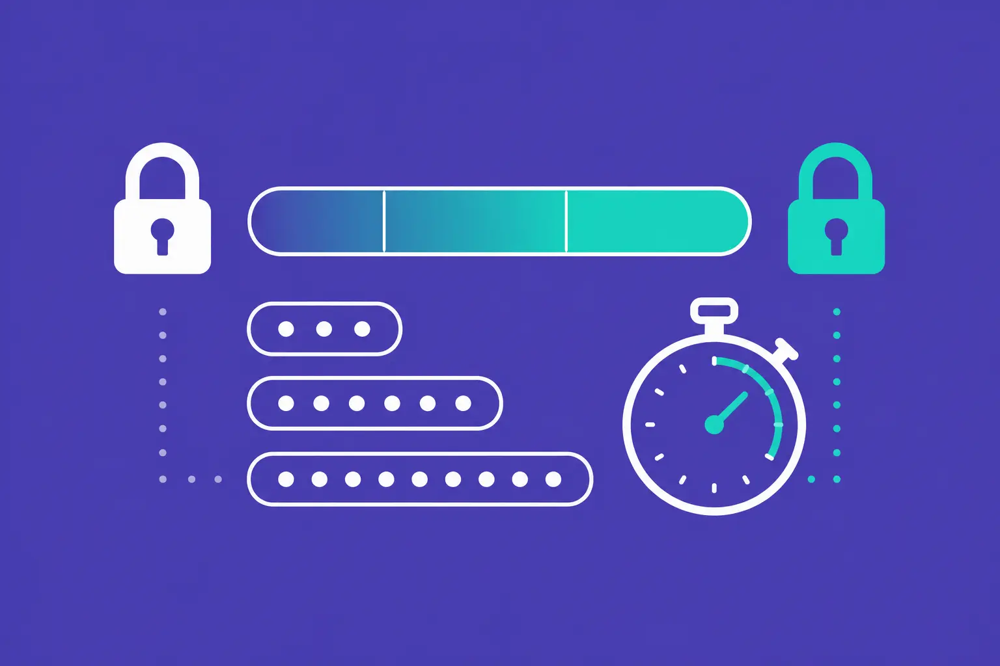
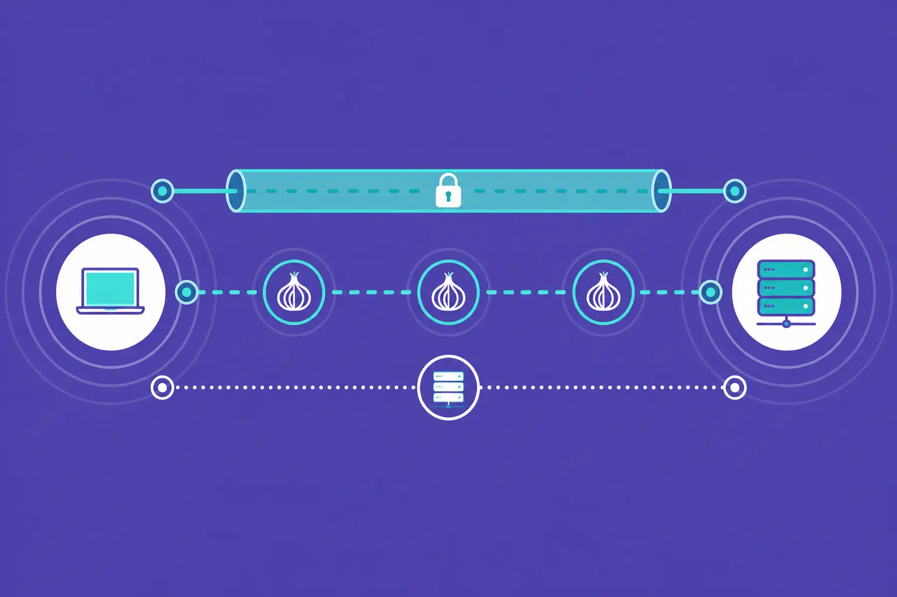

<!-- Hero：全寬左右對切；左黑底文與 CTA、右白底主視覺 -->

  

    

      <h1 class="home-hero__title">開始搭建資安防護， 成為村裡的希望。</h1>
      
<strong>資安升級不必追求一步到位，有開始加強防護最重要。</strong>隨著工作越來越依賴數位工具、雲端服務與即時溝通，風險其實每天都在累積。資安的升級，其實沒有想像中的困難，讓我們一起提升資安防護力，保護我們的村落吧！

      

        <a href="how-to/" class="md-button md-button--primary home-hero__cta">怎麼升級資安？ ›</a>
      

    

  

  

    
  

<!-- 「在這裡你可以找到」：依設計稿，淺灰背景、三欄卡片與按鈕 -->

  <h2>在這個新手村，你可以找到</h2>

  

    <article class="home-feature-card">
      

        
      

      <h3 class="home-feature-card__title">新手友善的資安操作教學</h3>
      

        <a href="personal/" class="md-button home-feature-card__button">升級個人資安 ›</a>
        <a href="org/" class="md-button home-feature-card__button">升級組織資安 ›</a>
      

    </article>

    <article class="home-feature-card">
      

        
      

      <h3 class="home-feature-card__title">資安事件的應對方式</h3>
      

        <a href="common/" class="md-button home-feature-card__button">常見資安事件 ›</a>
      

    </article>

    <article class="home-feature-card">
      

        
      

      <h3 class="home-feature-card__title">資安升級工具包</h3>
      

        <a href="guide/" class="md-button home-feature-card__button">資安升級工具包 ›</a>
      

    </article>
  

<!-- 文章預覽：白底、三張寫死卡片 -->

## 最新內容

  
  
<a href="blog/2026/04/17/mfa-basics.html">一次性密碼、驗證器、備份碼：MFA 核心機制入門</a>

  
2026/04/17

  
開啟多重驗證（MFA）之後，面對驗證應用程式、簡訊驗證碼、備份碼這幾個選項，該怎麼選？當手機遺失、換機時，還能不能進得了自己的帳號？

  <a href="blog/2026/04/17/mfa-basics.html" class="md-button md-button--primary">閱讀更多 ›</a>

  
  
<a href="blog/2026/04/24/password-strength.html">密碼強度與破解成本：長度、複雜度、密碼短語</a>

  
2026/04/24

  
密碼到底要設多長、要加什麼字元、為什麼光是「定期更換」不夠，以及當你不想靠密碼管理器時，怎麼設計一組記得住又真的難破的密碼。

  <a href="blog/2026/04/24/password-strength.html" class="md-button md-button--primary">閱讀更多 ›</a>

  
  
<a href="blog/2026/05/01/vpn-tor-proxy.html">VPN、Tor、Proxy：工具差異與使用時機</a>

  
2026/05/01

  
當你需要保護網路連線時，VPN、Tor、Proxy 各自能做到什麼、不能做到什麼，以及在不同威脅情境下該優先選哪一種。

  <a href="blog/2026/05/01/vpn-tor-proxy.html" class="md-button md-button--primary">閱讀更多 ›</a>

[更多文章  ›](blog/){ .md-button .md-button--outline }

<!-- Let knowledge spread：淺灰、左文右按鈕 -->

## 讓科技知識普及到每個角落

此網站及內容由「財團法人開放文化基金會（Open Culture Foundation, OCF）」編輯維護。我們長期投入知識共享與人才培育，推廣開放科技在各場域中的應用，同時致力於建立跨領域的信任與合作，讓科技不再只是少數人的工具，而是屬於所有人的資源。

[關於 OCF  ›](https://ocf.tw/){ .md-button .home-cta-button .home-cta-button--outline target="_blank" }
[捐款支持  ›](https://ocf.tw/donate/){ .md-button .md-button--primary target="_blank" }

