

# 🎮 資安防護新手村・探險

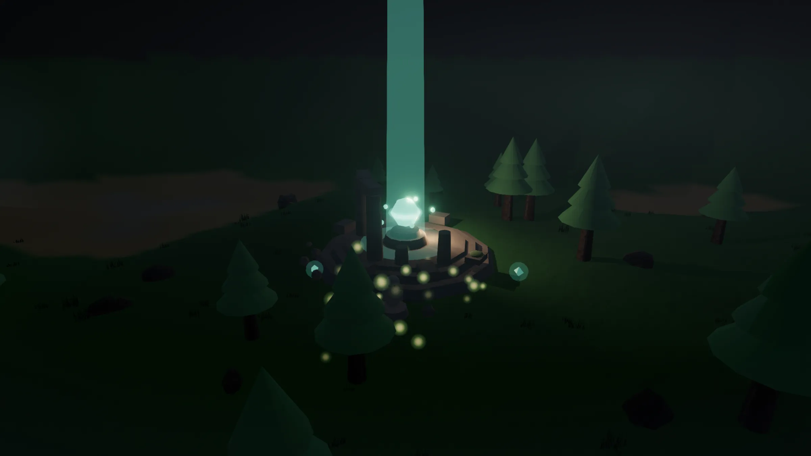{ loading=lazy }

**用「玩」的，把資安防護學起來。** 村莊原本由五道資安防線守護，如今防線崩塌、世界褪色入夜。你的任務：走出村莊，尋回散落荒野的五座「資安遺跡」，打敗守關怪物、逐一點亮防線，讓新手村重新明亮；而每一道防線，都對應「資安新手村」網站上一整套可實際操作的資安教材。

[▶ 開始遊戲](/games/?utm_source=play&utm_medium=site&utm_campaign=village-game){ .md-button .md-button--primary }
[先看看怎麼升級資安](/how-to/){ .md-button }

!!! tip "免安裝、開啟即玩"
    用瀏覽器直接玩，不必下載、不必註冊。電腦、手機、平板都可以，載入後即使離線也能繼續探索。介面支援**正體中文／简体中文／English**，會依你的裝置語言自動切換。

## 遊戲畫面

  

    <figure>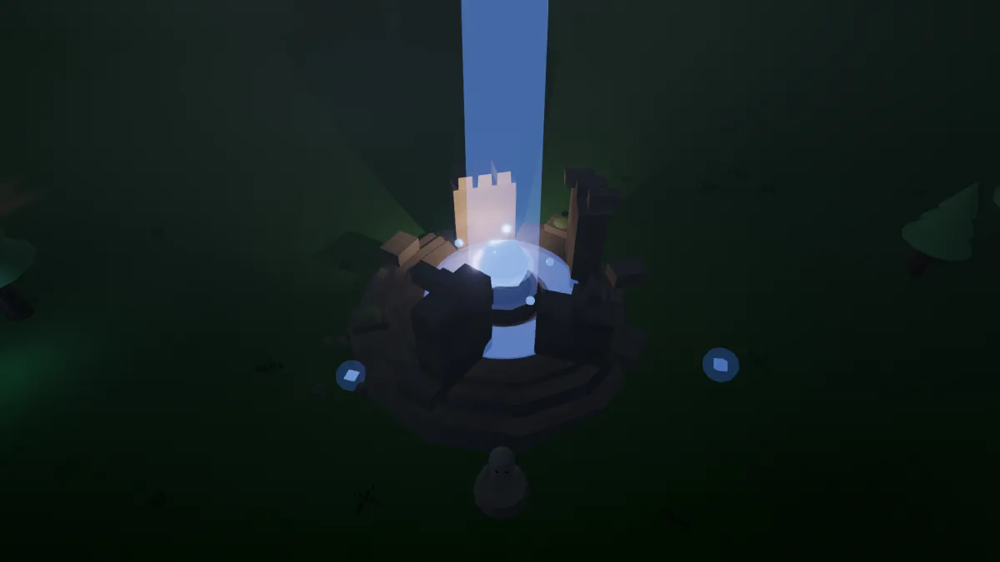<figcaption>擊敗守關者，遺跡升起一道防線光束</figcaption></figure>
    <figure>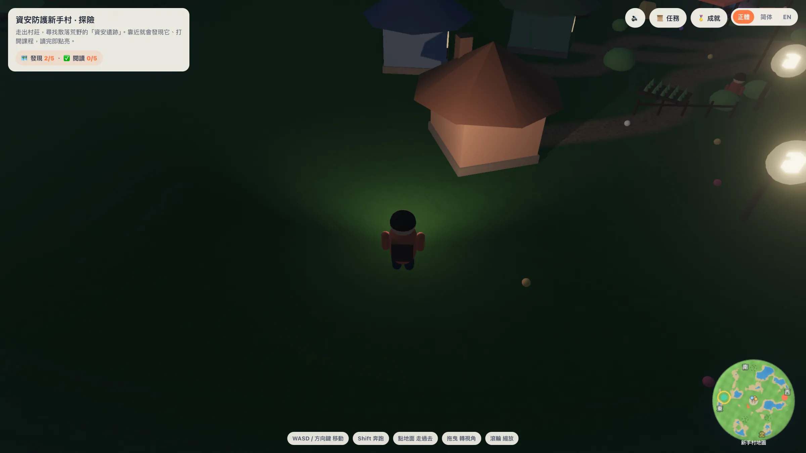<figcaption>提燈探索：HUD 與隨鏡頭旋轉的小地圖</figcaption></figure>
    <figure>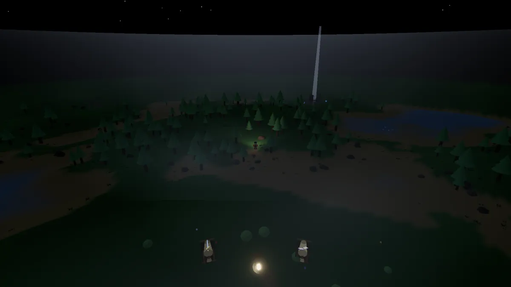<figcaption>入夜的世界：防線崩塌、大地失色</figcaption></figure>
    <figure>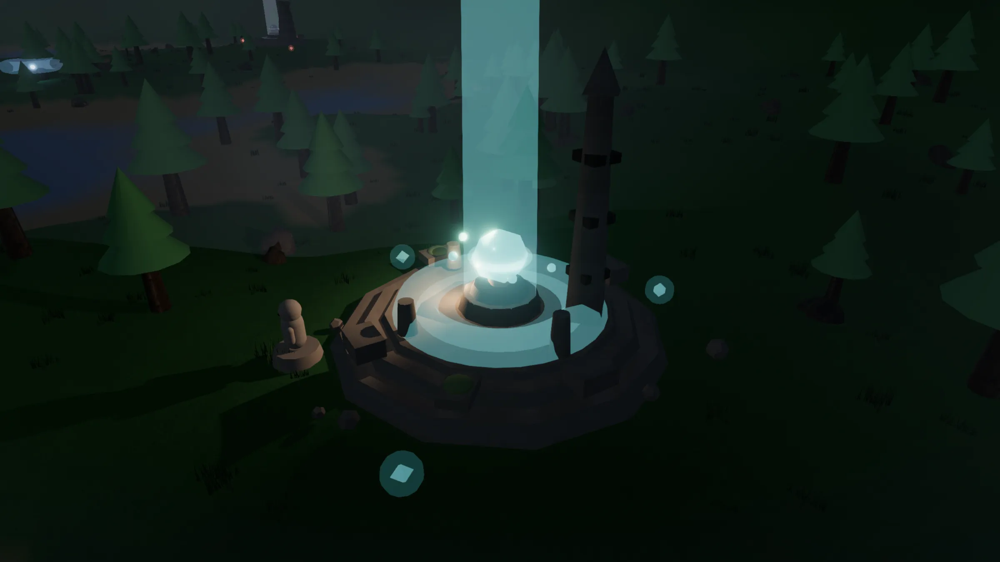<figcaption>荒野中沉睡的資安遺跡，等待被點亮</figcaption></figure>
    <figure>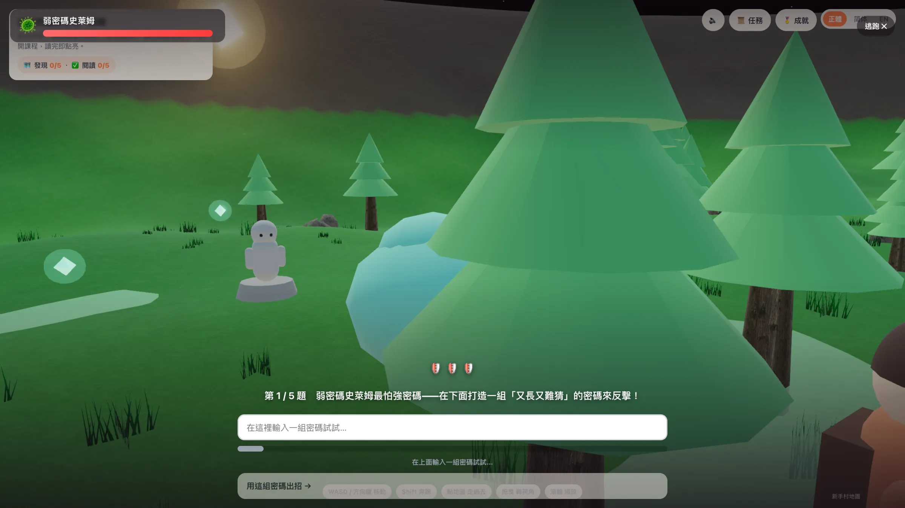<figcaption>遺跡守關：用學到的觀念答題闖關（輸入式）</figcaption></figure>
    <figure>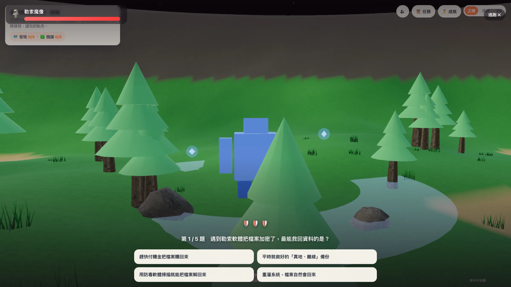<figcaption>不同遺跡、不同守關怪與題目（選擇題）</figcaption></figure>
    <figure>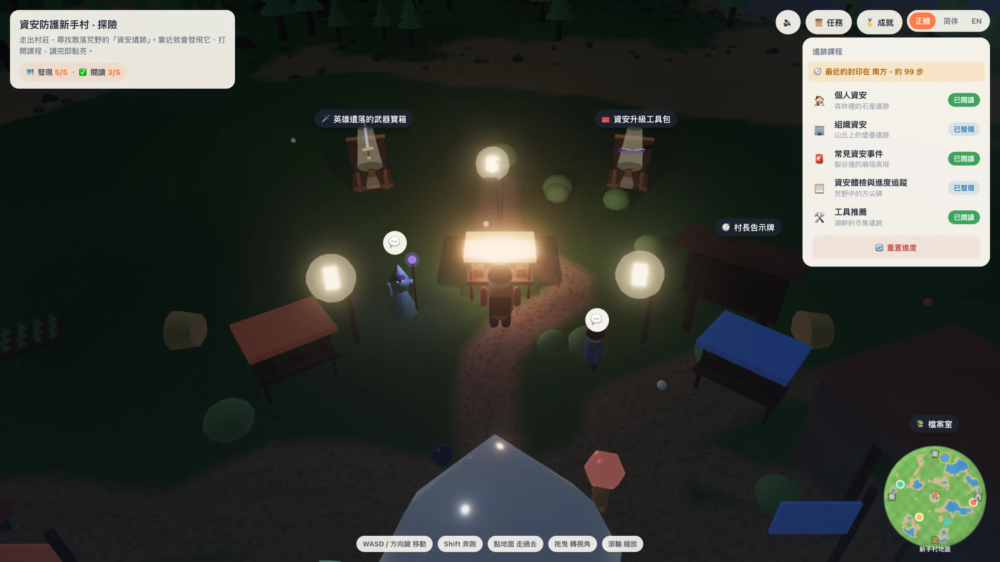<figcaption>任務日誌：五座遺跡的進度一覽</figcaption></figure>
    <figure>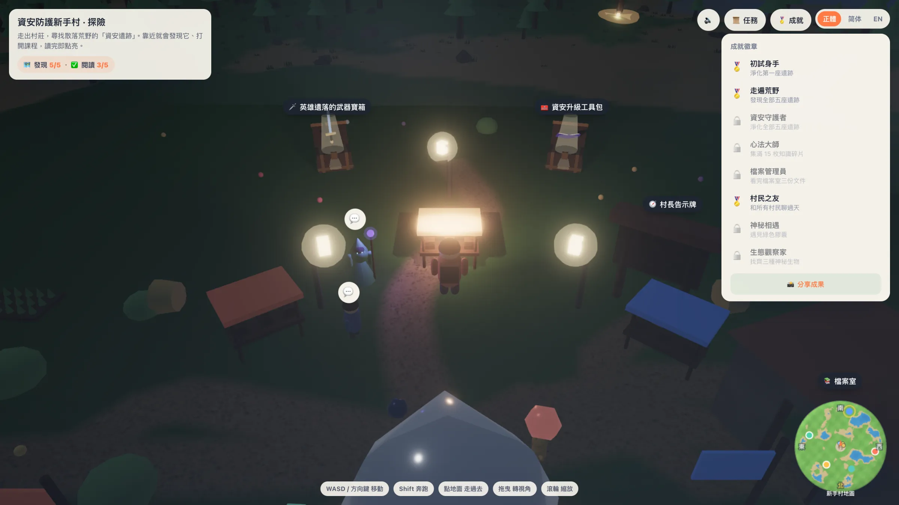<figcaption>成就徽章牆：探索與學習的足跡</figcaption></figure>
    <figure><figcaption>被重新點亮的資安遺跡：能量水晶</figcaption></figure>
    <figure>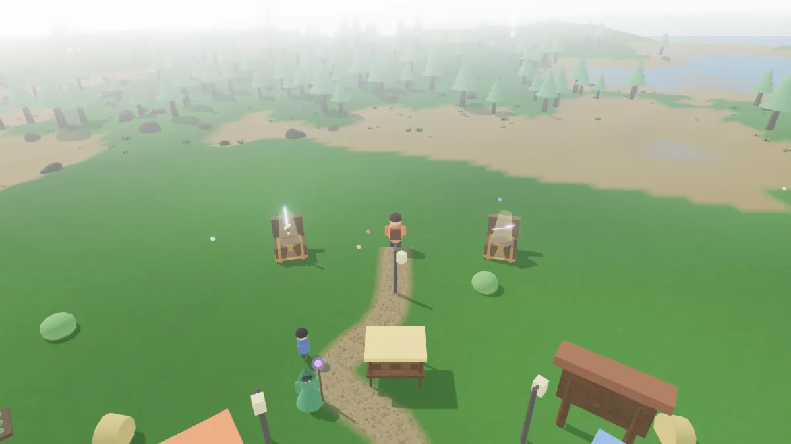<figcaption>五道防線修復後，村莊重見天光</figcaption></figure>
    <figure>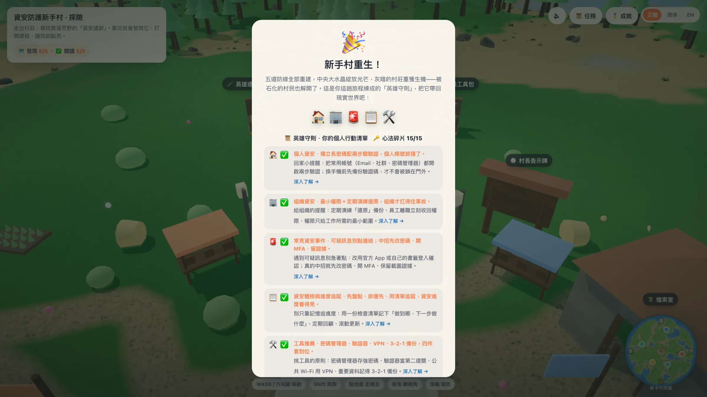<figcaption>通關慶祝：英雄守則與成果分享</figcaption></figure>
    <figure>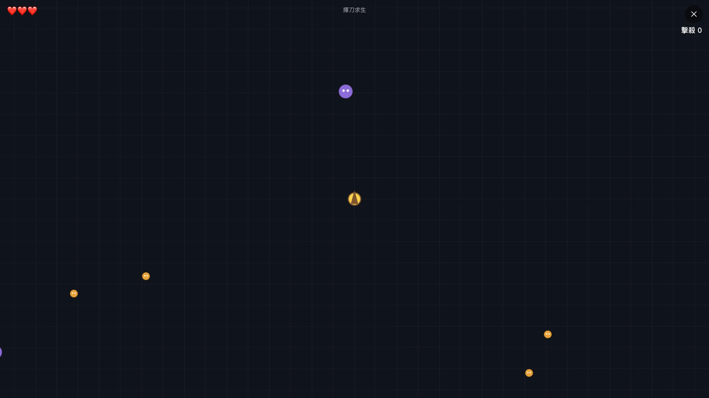<figcaption>隱藏彩蛋小遊戲「揮刀求生」</figcaption></figure>
  

  <button class="shots__nav shots__prev" type="button" aria-label="上一張">‹</button>
  <button class="shots__nav shots__next" type="button" aria-label="下一張">›</button>
  

## 你會學到什麼

遊戲帶你入門，完整、可逐步操作的內容都在「資安新手村」網站：

-   🏠 **個人資安**

    ---

    手機與電腦防護、帳號安全、安全瀏覽、加密溝通、海外出差。

    [前往教材 →](/personal/)

-   🏢 **組織資安**

    ---

    公務裝置、網路、帳號與權限管理、資料備份與資安政策。

    [前往教材 →](/org/)

-   🚨 **常見資安事件**

    ---

    釣魚、勒索軟體、密碼外洩、帳號被盜時的臨場應變。

    [前往教材 →](/common/)

-   🛠️ **資安工具推薦**

    ---

    密碼管理器、驗證器、VPN、3‑2‑1 備份策略。

    [前往教材 →](/tools/)

-   🧰 **資安升級工具包**

    ---

    盤點現況、風險評估、裝置稽核、資安政策範本，一步步追蹤資安升級進度。

    [前往教材 →](/guide/)

## 怎麼玩

- **移動**：電腦用鍵盤 `WASD` 或方向鍵；手機、平板用畫面上的觸控搖桿。
- **探索**：走出村莊，循著小地圖（會隨鏡頭轉向旋轉）尋找散落各處的資安遺跡與地標。
- **闖關**：走近遺跡與守關者互動，運用課程裡學到的觀念通過挑戰，逐一點亮五道防線。
- **完成**：五道防線全部修復，新手村就會重新明亮，別忘了把成果分享出去。

!!! info "可以在什麼裝置上玩？"
    這是一款在瀏覽器裡即時運算的 3D 遊戲，對裝置幾乎沒有特殊要求：

    - **瀏覽器**：支援 WebGL2 與 ES modules 的現代瀏覽器即可：Chrome／Edge 89+、Firefox 108+、Safari 16.4+（iPhone／iPad 需 iOS／iPadOS 16.4 以上）。大致就是「近三年更新過的瀏覽器」。
    - **電腦、手機、平板都行**：桌機用鍵盤＋滑鼠，手機與平板會自動顯示觸控搖桿。
    - **網路**：只有第一次載入需要連線（約 4 MB，含 Three.js 函式庫與貼圖）；載入後即使離線也能繼續探索。
    - **效能**：一般內顯就跑得動。較舊或較慢的裝置，可在開始畫面把畫質切到「精簡」；畫質分為自動／精簡／精緻三段，預設會依裝置自動調整。
    - **不需要**：安裝、註冊或登入，也不會在你的裝置留下個人資料。

## 適合誰

- **公民團體（CSO）/ NGO**：當作資安培訓的暖場破冰，或結訓後的「回家闖關」作業。
- **個人**：沒有資安背景也能上手，邊玩邊建立基本防護觀念。
- **想推廣資安的人**：免費、開源授權（CC‑BY 4.0），歡迎在課程、社團、活動中自由使用。

??? note "🛠️ 這款遊戲是怎麼做出來的（給想自己做的人）"
    整個世界都在瀏覽器裡用 [Three.js](https://threejs.org/) 即時運算，沒有遊戲引擎、沒有打包工具、不連任何外部 CDN。如果你也想做一個類似的小遊戲，這些是我們覺得值得分享的關鍵做法：

    - **不用 build、開檔就能跑**：用瀏覽器原生的 ES modules ＋ import map 直接載入 Three.js（r184，整份自存在站上的 `vendor/`）。整個專案就是一份 HTML 加幾支 `.js`，不需要 webpack／vite 之類的打包工具。
    - **大量植被用 InstancedMesh**：上千棵樹、草叢、石頭若各畫一次會拖垮效能；用 `InstancedMesh` 讓同一種物件「一次 draw call」畫完，是維持流暢的關鍵。
    - **WebGPU 我們認真試過**：另外做了一個 [WebGPU 試作評估頁](/games/webgpu.html)，會自動選用 WebGPU、不支援就退回 WebGL2，並即時顯示使用中後端、FPS 與 draw call。結論是：遊戲已用 InstancedMesh 把 draw call 壓得很低，實際負載下 WebGL2 就能穩定跑滿螢幕更新率，要把壓力等級拉到遠超遊戲所需，才看得出 WebGPU 的差距。加上 WebGL2 在手機與各家瀏覽器（特別是 iOS／Safari）支援更普及，所以正式遊戲就用 WebGL2 達標，不額外要求 WebGPU。
    - **地形用函式算、不用圖檔**：地面起伏由一個高度函式即時計算，再用頂點顏色畫出沙地／草地／岩石，省下一張 heightmap 貼圖。
    - **水面的柔邊**：海岸用一張預烤的「離岸距離」貼圖，讓水的透明度漸層淡出，避免地面與水面交界處閃爍（z-fighting）。
    - **一個參數控制日夜**：用單一個「繁榮度」數值（0 夜晚 → 1 白天）同時驅動光照、色調、群山起伏、小地圖與介面配色；改一個值，整個世界就跟著變。
    - **後製讓畫面更耐看**：用 `EffectComposer` 串接 Bloom（讓水晶與光束發光）、色彩分級與抗鋸齒，並依裝置效能自動開關。
    - **3D 場景裡的文字**：遺跡名牌、NPC 對話泡泡用 `CSS2DRenderer`，直接拿 HTML／CSS 當作 3D 世界中的標籤；小地圖則是另一塊 2D canvas，會隨鏡頭轉向旋轉。
    - **角色動畫不靠骨架**：主角的走路、跳躍、二段跳轉身，是用程式即時旋轉四肢關節做出來的，沒有匯入骨架動畫檔，檔案小又好控制。
    - **存檔就用 localStorage**：探索與闖關進度存在瀏覽器本機，關掉再打開還在，也不需要後端伺服器。
    - **顧及手機**：用裝置像素比上限（pixel-ratio clamp）＋畫質分段，避免在高解析度螢幕上把填充率（fill-rate）吃爆。
    - **彩蛋是獨立的 2D 小遊戲**：「揮刀求生」是一塊獨立的 2D canvas，與 3D 主世界完全解耦，互不影響效能。

    整個遊戲全程離線、無外部相依，並以 CC‑BY 4.0 開源，[原始碼在 GitHub](https://github.com/ocftw/ssd)，歡迎拆開來看，照著做出你自己的版本。

## 關於這款遊戲

由[財團法人開放文化基金會（OCF）](https://ocf.tw/)製作，是「資安新手村」教材網站的延伸實驗。整個世界以 Three.js 在瀏覽器即時運算，全程離線、無外部相依，原始碼隨網站一同[開源於 GitHub](https://github.com/ocftw/ssd)。

[▶ 進入新手村](/games/?utm_source=play&utm_medium=site&utm_campaign=village-game){ .md-button .md-button--primary }
