# :octicons-log-16: 政策制定

???+ abstract "學習歷程：「政策制定」"

    <figure markdown="span">
    
    <figcaption><small>「政策制定」階段</small></figcaption>
    </figure>

    您目前在「[政策制定]」，依政策範本建立組織內的規範並落實執行。（完整流程：「[章節內容]」、「[操作手冊]」、「[政策制定]」、「[狀態評估]」、「[關懷與諮詢]」）

    [章節內容]: ../chapter/index.md
    [操作手冊]: ../user_guide/index.md
    [政策制定]: ../policy/index.md
    [狀態評估]: ../assessment/index.md
    [關懷與諮詢]: ../support/index.md

在組織內制定政策是確保組織順利運作並保護資訊資產的重要一環。政策是一套明確的規範和指引，旨在引導組織成員的行為和決策，以確保符合保護資訊安全和維護組織重要資產。

政策的制定是一個持續的過程，需要不斷地進行評估和改進。隨著組織環境的變化和新的威脅的出現，政策需要不斷地進行修訂和更新，以確保其仍然符合組織的需求和目標。

本章節將以「章節內容」各主題項目提供相對應的「**政策範本**」，可參考後依組織狀況、適時調整並制定與落實。

<figure markdown="span">
  
  <figcaption><small>閱讀「章節內容」後透過「政策制定」範本制定與落實</small></figcaption>
</figure>

## 制定流程

<figure markdown="span">
  
  <figcaption><small>「政策制定流程」：「範本參考」、「政策制定」、「政策落實」、「意見回饋」</small></figcaption>
</figure>

### 範本參考

政策範本可參考來自教材網站上的素材，協助您與組織能迅速從零開始建立政策。在這個期間，也將一併盤點組織內已在執行的政策或工作規範，是否能補強或是合併為教完整的規範。

### 政策制定

「政策制定小組」在頒佈修正或更新後的資安政策後，可召集全體夥伴參與檢視新版本內容，可提供線上共筆文件呈現或紀錄討論過程。

### 政策落實

完成全體夥伴的參與討論與修正後，「政策制定小組」須正式頒布與公告執行時間，政策規範內容也建議放置在組織內夥伴方便取閱的位置。

### 意見回饋

在資安政策實行過程中，持續且開放的蒐集組織內夥伴的意見回饋，可持續使用線上共筆文件做意見蒐集管道，或提供問卷表單方式蒐集。

!!! success "定期檢視"

    - 「政策制定」、「政策落實」建議每六個月定期審視、增補修訂，並與「意見回饋」所蒐集到的事項進行新一輪的討論。
    - 如修訂過程中遇到任何困難，可諮詢服務導入團隊予以協助。
