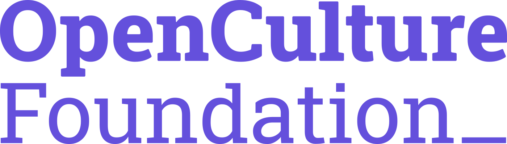

# 疑問諮詢

對於專案或是課程有任何意見，可以直接透過表單反應給我們作為未來的調整與改善。

[:octicons-mail-16: 意見回饋信箱](mailto:ssd@ocf.tw){ .md-button }

## 諮詢團隊

#### :octicons-shield-check-16: CSCS 公民團體資安暨隱私交流計劃

<figure markdown="span">
{width=50%}
<figcaption><small>CSCS</small></figcaption>
</figure>

**Civil Society Cyber Shield（CSCS）公民團體資安暨隱私交流計劃**，台灣擁有在國際間相當知名的開源社群，亦有著極為活躍但面臨風險的公民社會。為了促進這兩個社群之間的交流，2017 年，開放文化基金會國際交流組與華人民主書院、台灣駭客協會、台灣人權促進會共四個組織共同開啟 CSCS 專案：Civil Society Cyber Shield，讓社會運動與組織者能夠接觸最新的資安工具、對抗資安威脅，在安全的線上環境中推動社會議題。

[:octicons-shield-check-16: CSCS 公民團體資安暨隱私交流計劃](https://cscs.asia/){ .md-button target="_blank"}

#### :octicons-shield-check-16: eQualitie

<figure markdown="span">
{width=50%}
<figcaption><small>eQualitie</small></figcaption>
</figure>

[eQualit.ie](https://equalit.ie/){target="_blank"} 是一個國際性組織，由來自不同背景的人權倡議夥伴組成，致力於保護和促進基本人權，特別是在網路自由。他們開發開源工具，提供隱私保護、網路安全及資訊管理功能，並以公開透明的方式運作。eQualit.ie 的主要目標是透過技術和教育提升夥伴在數位時代中的安全能力，確保他們能在面對審查、監控和其他威脅時仍能自由表達和取得資訊。組織的核心原則包括重視隱私、提升數位安全、保持公開透明以及捍衛言論自由和公正合法社會。

其中 [Deflect](https://equalit.ie/portfolio/deflect/){target="_blank"} 服務協助抵禦分散式阻斷服務（DDoS）攻擊，將站在公民團體所架設的網站最前緣，作為第一線阻擋惡意流量攻擊。

[:octicons-shield-check-16: Deflect NPO 申請方案](https://deflect.ca/non-profits/){ .md-button target="_blank"}

#### :octicons-people-16: 財團法人開放文化基金會 OCF

<figure markdown="span">
{width=400}
<figcaption><small>Open Culture Foundation</small></figcaption>
</figure>

[財團法人開放文化基金會](https://ocf.tw){target="_blank"}（Open Culture Foundation, OCF）是一個致力於推動開放科技（開放源碼、開放資料及開放政府）並關注網路自由與數位人權的非營利組織。基金會成立於 2014 年，旨在促進資訊的自由流通促成一個開放、安全、涵融且眾人參與的數位公民社會，並推動社會各界透過開放的方式進行創新和合作、以開放科技和跨界合作來應對數位時代的各項威脅並健全數位社會的發展。

針對組織、個人、培訓資源、網路安全防護、研究報告、緊急通報機制 ... 等與資訊安全相關的資源與報告，可以參考本會所整理的資源指引。

[:octicons-people-16: 資訊安全資源指引](https://security.ocf.tw/){ .md-button target="_blank"}
