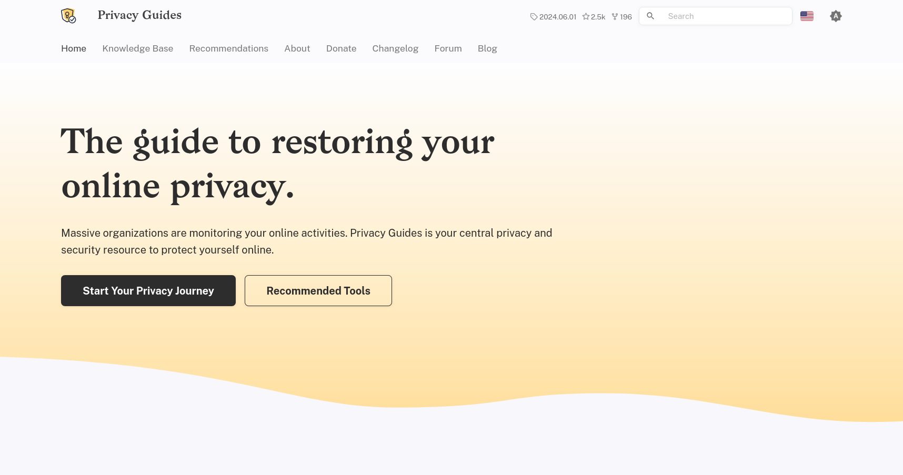

# :material-bookmark-check: 參考資源

## 參考資料

### Security in-a-box

<figure markdown="span">

<figcaption><small>Screenshot on Securityinabox</small></figcaption>
</figure>

由 [Front Line Defenders](https://www.frontlinedefenders.org/) 提供關於裝置、作業系統相關的操作設定。

[:octicons-shield-check-16: Security in-a-box](https://securityinabox.org/en/){ .md-button }

### Privacy Guides

<figure markdown="span">

<figcaption><small>Screenshot on Privacy Guides</small></figcaption>
</figure>

Privacy Guides 致力提供個人資料隱私保護的教學內容，網站由志工群協助貢獻內容。

[:octicons-shield-check-16: Privacy Guides](https://www.privacyguides.org/){ .md-button }

### Surveillance Self-Defense

<figure markdown="span">

<figcaption><small>Screenshot on Surveillance Self-Defense (eff.org)</small></figcaption>
</figure>

由[電子前哨基金會](https://www.eff.org/)（Electronic Frontier Foundation, eff）發起的專案，提供各項關於網路隱私、規避審查的自我防護抵禦工具與實踐守則。

[:octicons-shield-check-16: Surveillance Self-Defense](https://ssd.eff.org/){ .md-button }
