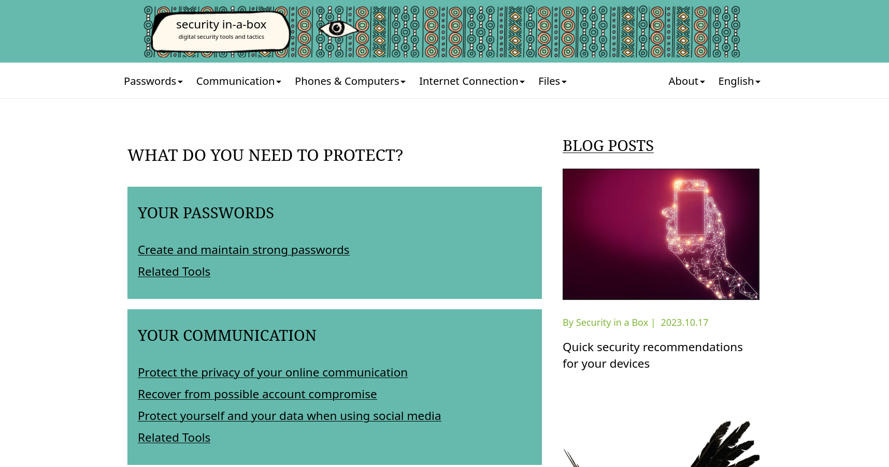
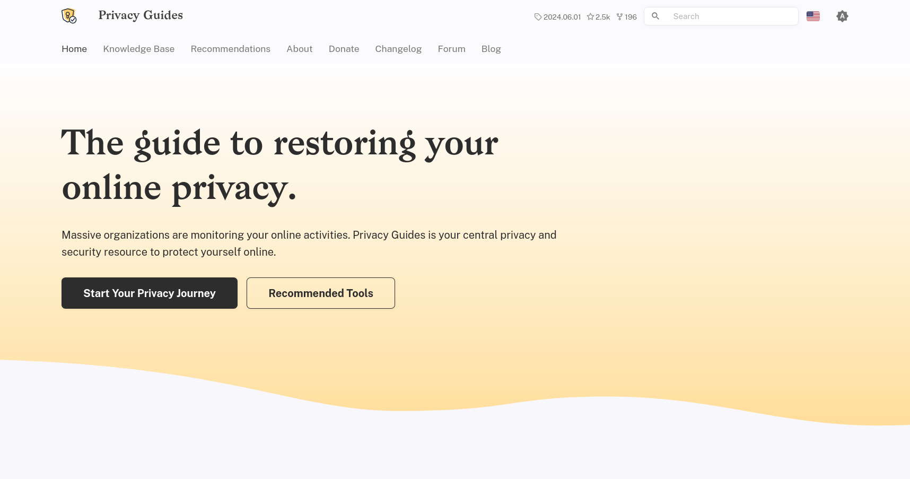
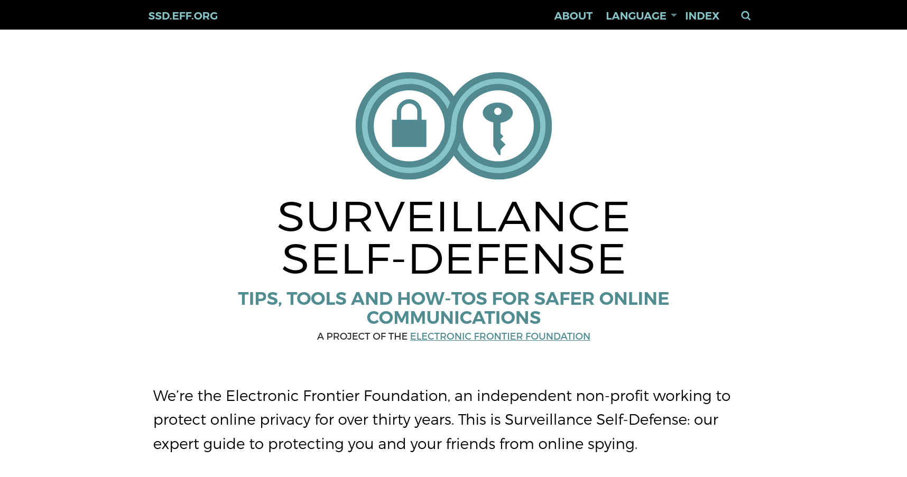

# 工具推薦

本頁彙整教材內各章節推薦的工具，依使用情境分類，並附上「對應章節」方便你跳到完整的挑選與設定步驟。所有列出的工具都以**開源、注重隱私**為優先；同類別中通常會推薦一到兩款主力，再加上一兩款替代方案，避免讀者選擇困難。

## 帳號與密碼防護

### 密碼管理器

- **Bitwarden** — 雲端同步、開源、有免費版與團隊版，主推給多數使用者與小型團體。[官網](https://bitwarden.com/){target="_blank"}
- **Proton Pass** — 與 Proton Mail 同套帳號、開源、支援 Passkey。[官網](https://proton.me/pass){target="_blank"}
- **KeePassXC** — 本地端開源工具，資料只留在自己裝置上。[官網](https://keepassxc.org/){target="_blank"}
- **Psono** — 適合需要自架、共用團隊密碼的組織。[官網](https://psono.com/){target="_blank"}

對應章節：[個人 — 密碼管理器](../chapter/profile/password_manager.md)、[組織 — 密碼管理](../org/account/password.md)

### 多重驗證（MFA）App

- **Google Authenticator** — 入門首選，免費、好上手。[Android](https://play.google.com/store/apps/details?id=com.google.android.apps.authenticator2){target="_blank"} / [iOS](https://apps.apple.com/tw/app/google-authenticator/id388497605){target="_blank"}
- **Aegis Authenticator** — Android 開源工具，支援匯出備份。[官網](https://getaegis.app/){target="_blank"}
- **2FAS** — 跨平台、開源。[官網](https://2fas.com/){target="_blank"}
- **Ente Auth** — 跨平台、開源、支援端對端加密同步。[官網](https://ente.com/auth){target="_blank"}

對應章節：[個人 — 多重驗證](../chapter/profile/mfa.md)、[組織 — 雙重驗證](../org/account/mfa.md)

### 安全金鑰（實體裝置）

- **YubiKey**：型號多、相容性最廣。[Yubico 官網](https://yubico.com/){target="_blank"}
- **Nitrokey**：開源硬體設計。[Nitrokey 官網](https://nitrokey.com/){target="_blank"}

對應章節：[個人 — 安全金鑰](../chapter/profile/security_key.md)

## 加密通訊

### 加密訊息對話

- **Signal** — 主推給多數使用者，開源、預設端對端加密。[官網](https://signal.org/){target="_blank"}
- **SimpleX Chat** — 不需手機號碼、無帳號識別碼，隱私設計最徹底。[官網](https://simplex.chat/){target="_blank"}

對應章節：[加密訊息對話](../chapter/e2ee/im.md)

### 加密電子郵件

- **Proton Mail** — 瑞士服務，註冊後即可使用，與同服務用戶自動加密。[官網](https://proton.me/mail){target="_blank"}
- **Tuta** — 德國服務，介面簡潔、無廣告。[官網](https://tuta.com/){target="_blank"}
- **Mailvelope** — 在既有信箱（如 Gmail）內用 PGP 加密郵件，門檻較高。[官網](https://mailvelope.com/){target="_blank"}

對應章節：[加密電子郵件](../chapter/e2ee/mails.md)

## 隱私瀏覽與網路連線

### 瀏覽器

- **LibreWolf** — 開箱即強化隱私，少動手設定。[官網](https://librewolf.net/){target="_blank"}
- **Brave** — 隱私與效能平衡，內建廣告阻擋。[官網](https://brave.com/){target="_blank"}
- **Firefox** — 擴充彈性高，可加裝隱私附加元件。[官網](https://www.mozilla.org/zh-TW/firefox/){target="_blank"}

對應章節：[瀏覽器](../chapter/network/browser_privacy.md)

### VPN

- **Proton VPN** — 伺服器多、有臺灣節點。[官網](https://protonvpn.com/){target="_blank"}
- **Mullvad** — 匿名帳號（僅帳號編號）、信用卡或現金都可付款。[官網](https://mullvad.net/zh-hant){target="_blank"}
- **IVPN** — 最小付費期間為週、可匿名帳號。[官網](https://www.ivpn.net/){target="_blank"}
- **Riseup VPN** — 免費、開源、不需註冊，由社群維運。[官網](https://riseup.net/en/vpn){target="_blank"}
- **Outline VPN** — 自架方案，由組織自行管理 VPN 伺服器。[官網](https://getoutline.org/zh-TW/){target="_blank"}

對應章節：[VPN](../chapter/network/vpn.md)

## 視訊會議與協作

- **Jitsi Meet** — 不需帳號、加密視訊會議。[官網](https://jitsi.org/){target="_blank"} / [Greenhost 提供的免費實例](https://meet.greenhost.net/){target="_blank"}
- **Big Blue Button (BBB)** — 自由開源的線上會議平台，瀏覽器即可使用。[官網](https://bigbluebutton.org/){target="_blank"}
- **Nextcloud** — 可自架雲端檔案儲存與協作平台。[官網](https://nextcloud.com/){target="_blank"}
- **Mattermost** — 開源團隊協作與即時通訊平台，支援自架。[官網](https://mattermost.com/){target="_blank"}

## 文書與郵件 Client

- **LibreOffice** — 文書、試算表、簡報，相容 Microsoft Office 格式。[官網](https://www.libreoffice.org/){target="_blank"}
- **OnlyOffice** — 文書、試算表、簡報，支援多人線上協作。[官網](https://www.onlyoffice.com/){target="_blank"}
- **Thunderbird** — 開源 Email Client，可整合多帳號、行事曆與加密功能。[官網](https://www.thunderbird.net/){target="_blank"}

## 高風險情境

當你或組織成員在審查嚴格的網路環境、邊境檢查或敏感倡議現場工作時，可考慮這些工具：

- **Tor 瀏覽器** — 透過 Tor 網路隱藏真實 IP、強化匿名。[官網](https://www.torproject.org/){target="_blank"}
- **Tails** — 從 USB 啟動的安全作業系統，離開電腦不留痕跡。[官網](https://tails.boum.org/){target="_blank"}
- **VeraCrypt** — 加密整個磁碟或建立加密容器存放敏感檔案。[官網](https://www.veracrypt.fr/){target="_blank"}
- **MAT2（Metadata Anonymisation Toolkit）** — 移除檔案中可能洩露身份的後設資料（Metadata）。[官網](https://0xacab.org/jvoisin/mat2){target="_blank"}

對應章節：[海外出差安全指南](../chapter/abroad/guide.md)、[出差風險評估](../chapter/abroad/risk.md)

## 延伸學習資源

### Security in-a-box

<figure markdown="span">

<figcaption><small>Screenshot on Securityinabox</small></figcaption>
</figure>

由 [Front Line Defenders](https://www.frontlinedefenders.org/){target="_blank"} 提供關於裝置、作業系統相關的操作設定。

[:octicons-shield-check-16: Security in-a-box](https://securityinabox.org/en/){ .md-button target="_blank"}

### Privacy Guides

<figure markdown="span">

<figcaption><small>Screenshot on Privacy Guides</small></figcaption>
</figure>

Privacy Guides 致力提供個人資料隱私保護的教學內容，網站由志工群協助貢獻內容。

[:octicons-shield-check-16: Privacy Guides](https://www.privacyguides.org/){ .md-button target="_blank"}

### Surveillance Self-Defense

<figure markdown="span">

<figcaption><small>Screenshot on Surveillance Self-Defense (eff.org)</small></figcaption>
</figure>

由[電子前哨基金會](https://www.eff.org/){target="_blank"}（Electronic Frontier Foundation, eff）發起的專案，提供各項關於網路隱私、規避審查的自我防護抵禦工具與實踐守則。

[:octicons-shield-check-16: Surveillance Self-Defense](https://ssd.eff.org/){ .md-button target="_blank"}
