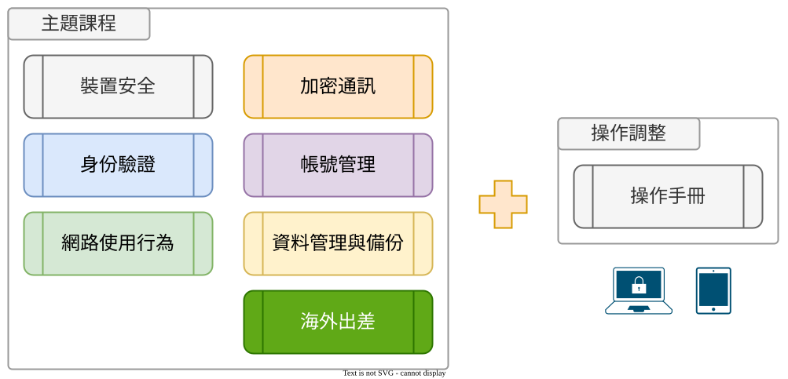

# :octicons-gear-16: 操作指南

???+ abstract "學習歷程：「操作指南」"

    <figure markdown="span">
    
    <figcaption><small>「操作指南」階段</small></figcaption>
    </figure>

    您目前在「[操作指南]」，指引您針對裝置或作業系統調整設定，以提昇資安抵禦能力。（完整流程：「[章節內容]{target="_blank"}」、「[操作指南]{target="_blank"}」、「[政策制定]{target="_blank"}」、「[狀態評估]{target="_blank"}」、「[關懷與諮詢]{target="_blank"}」）

    [章節內容]: ../chapter/index.md
    [操作指南]: ../user_guide/index.md
    [政策制定]: ../policy/index.md
    [狀態評估]: ../assessment/index.md
    [關懷與諮詢]: ../support/index.md

## 說明

「操作指南」對應到課程主題中的八大主題概念，從概念基礎上，衍伸出個別主題於辦公環境和使用行為上的落實建議和相關工具使用。在這個部分，依據每個主題內容，將分別針對裝置、作業系統、軟體安裝與設定...等，進行實際調整和工具裝載、使用，以確實的提昇資安抵禦能力。

強烈建議以主題為單位，先行閱讀過「章節內容」內對應的概念說明，先具備基礎的知識，再進入「操作指南」。這樣，會更了解其操作背後的目的與達成的目標。
本操作指南也搭配了[「課後任務清單」](https://ssd.ocf.tw/assessment/checklist/homework.html)，便於組織管理者盤點每個主題需執行任務的完成進度，讓每個動作都不落空。

<figure markdown="span">
  
  <figcaption><small>閱讀「章節內容」後透過「操作指南」修正與加強</small></figcaption>
</figure>
